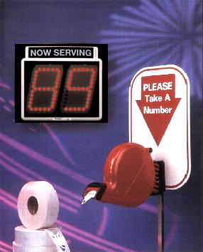

# EXAM: Web Apps II

### Getting Started
 - Fork this repository under your own account
 - Clone the forked repository to your computer
 - Commit your progress frequently and with descriptive commit messages (1p)
 - All your answers and solutions should go in this repository

### What can I use?
- You can use any resource online, but **please work individually**
- **Don't just copy-paste** your answers and solutions, use your own words instead.


## Tasks
Implement a Queue Management Application (Sorszámhúzó) to help
administrative tasks at Green Fox Academy.   
The user can choose their case group from a list,
and gets its number in the line.



### 0. Initialize a node package in this folder. (1p)
- the test command should be `node test.js`
- the `node_modules` folder should be gitignored.

### 1. frontend: HTML, DOM & events (3p)
- the frontend should follow style guide and have descriptive variable names. (1p)
- the frontend should have the following components: (1p)
  - a paragraph of text containing this copy: "Thank you for visiting our website! Pick a case group and click the button for your number."
  - a select dropdown with the following options:
    - "Administrative concerns" with the value "admin"
    - "Technical questions" with the value "tech"
    - "Getting my Green Hoodie" with the value "hoodie"
  - a button with the text "Go"
- clicking the button should change the button's text to "loading" (1p)

### 2. frontend: XHR (2p)
- clicking the button should send a `post` request to the `/turnomatic` endpoint
  - the request should contain the value of the case dropdown
  - the request body should follow this format (1p):
  ```json
  {
    "case": "hoodie"
  }
  ```
- when the response arrives from the server, the frontend should
  - display the number in the following format: "Your number is 123"
  - change the button's text to "get another number" (1p)

### 3. backend: node, express, mysql (6p)
- the backend should follow style guide and have descriptive variable names. (1p)
- the backend should serve the static files for the frontend (1p)
- create the `turnomatic` database and fill it by importing `turno.sql` found in this repository, **or** create a table by hand based on `turno.sql`'s content. connect to database. (1p)
- the backend should have a `post` endpoint on `/turnomatic`
  - on receiving data in the request, the backend should insert the incoming case in
  the `turnomatic` database, in the `cases` table (1p)
  - after successfully saving the received data to the database, and adding up the final number - more on that later -, the backend should send a response in the following format (1p):   
  ```json
  {
    "status": "ok",
    "number": "123"
  }
  ```
  - if any error (eg. database error) occures, the server should respond with (1p):   
  ```json
    {
      "status": "error",
      "message": "server error, please find a member of staff to get your number"
    }
  ```

### 5. backend: unit testing (4p)
- create a separate file for the number generating module and use it in your server file from there (1p)
- the number generator should get the case number from the database and the case category name from the request as parameters, and return a generated 3 digit case number as follows (1p):
  - if the number is smaller than 100, pad the number with 0s from the left to get a 3 digit number: eg. 7 should become 007
  - if it's a `tech` case, add 500 to the number
  - if it's an `admin` case, add 100
  - if the resulting number is bigger than 999, crop it - eg. 1024 should be 024
- running `npm test` should show green tests (1p)
  - write unit tests for the cases in `test.js` found in this repository
  - write 3 more test cases testing other edge cases (1p)
